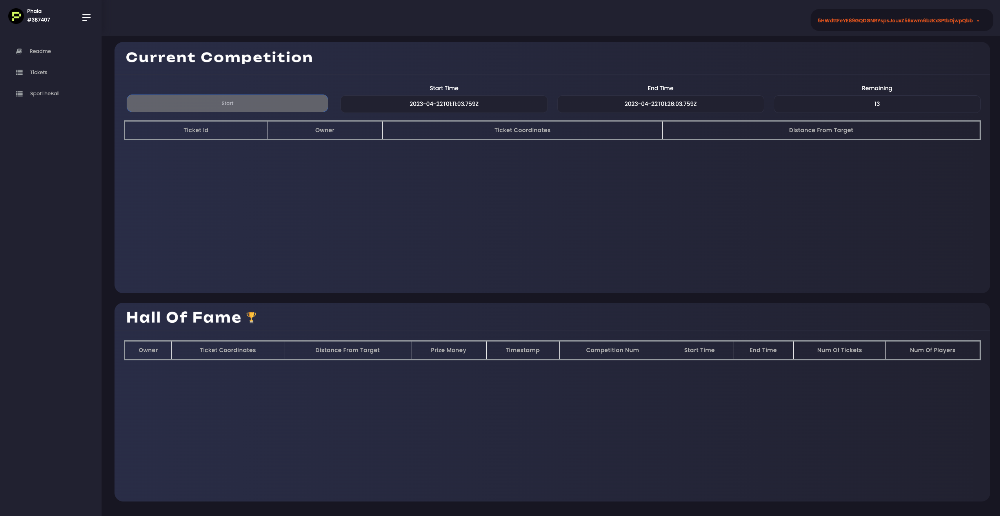
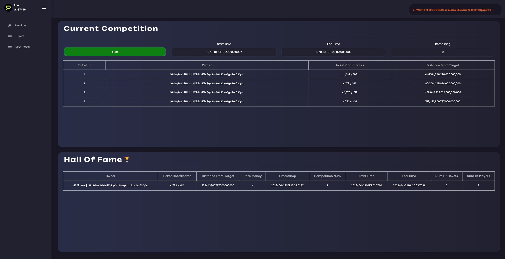
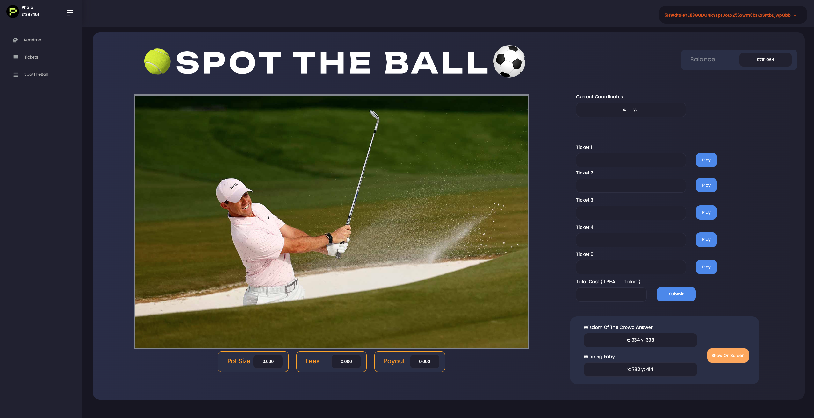
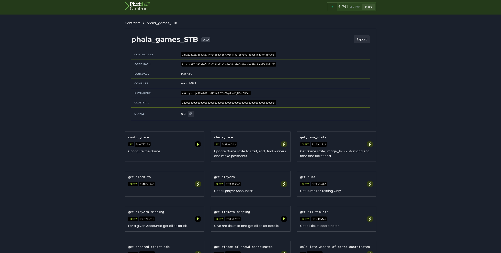
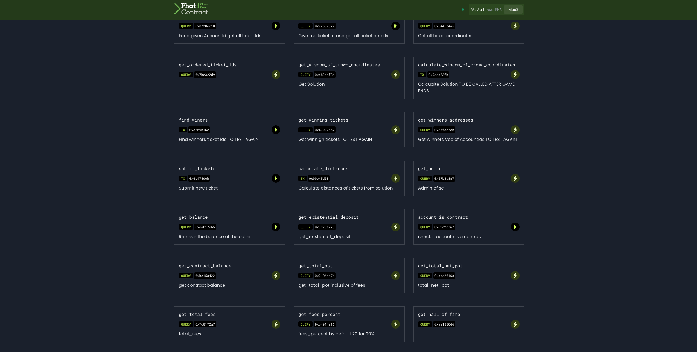

# Phala Game Competions - Spot the Ball

 

## Table of Contents

1. [General Info](#general-info)
2. [Repos](#repos)
3. [Installation](#installation)
4. [Business Logic](#business-logic)
5. [Phat Contract Logic](#phat-contract)

 

## General Info

---

One of the main unique aspects of Phala and Phat contract is the fact that it preserves privacy.

Unlike other parachains the state variables of a Phat contract are encrypted.

In addition, Phat contructions offer immense computational functionalities, which in other parachains are either not available or very expensive to run

Bearing in mind the above our team believes that Phat contraccts and Phala parachain are perfect places to deploy and run game competitions.

One very poopular competition is the Spot the Ball competition, where the game participants try to guess the place of a ball in a sports image and the one with the closest coordinaties wins the big prize.

 

## Repos

---

Phat contracts repo

https://github.com/Entity54/Phat-Games-STB

 

Front End repo

https://github.com/Entity54/Phat-Front-End-SpotTheBall

 

### Installation

---

The Phat contracs were written in the ink! Version 4. In the Phat contract repo the user can either build these from scratch usign:

    $cargo contract build

or can find the ABI(metadata) phala_games_STB.json and the phala_games_STB.contract in the Phat_contracts folder here

For the front end the user can

    $yarn
    $npm start

and can see in http://localhost:3000/ the front end application connected to this Phat contract

---

 
 

## Business Logic

---

In the Tickets page we can see the Start button which is Green when a new game can be started or greyed out if there is already an active game. A new game can only start after the completion of any active game.

The Start and End time show when the game started and when it will be completed

Finally the remaining amount of minutes in the game is shown

 

 

Once a new game has started a fresh image is loaded which has the ball digitally removed

Each game participant can click on the image and create a ticket with the generated coordinates

Each ticket has a cost of 1 PHA and the user can play one or multiple tickets per time

Each time the user clicks on the image he should click the Play button to generate a ticket with these coordinates

When he is ready he can click Submit to submit his tickets. The total cost in PHA is shown next to the submit button

 

 

The Pot Size shows the total PHA that have been deposited

The Payout is 80% of the Pot Size and the Fees (20%) is for the owner of the game.

 

 

When the game expires the Number of tickets played in the current game is shown underneath the Start button

The winner of the game along with previous winners are shown in the second tab Hall of Fame with all relevant details e.g. owener of the ticket winning coordinates, competition id, number of players (account addresses), number of tickets and the Prize Money won

 

 

When the competition completes in the SpotTheBall page we can see the solution: "Wisdom of the Crowd Answer" and the winning ticket coordinates

Finally the user account balance in PHA is shown at the top right corner of the page

The wisdom of the crowd dictates that the more tickets played, the closer the average prediction of the coordinates is to the real position of the ball.

Therefore the winning ticket is the one with the smallest distance to the Wisdom of the Crowd Answer

 

 

 
 
 
 

## Phat Contract

---

 

 

By clicking the Start button in the front end in essence we call config_game function passing the imagehash (to be loaded from 4everland in next relase) the start and end time of th egame the ticket cost and fees percentage. The default ticket cost is 1 PHA and the default fees percentage is 20 for 20%

Soon after the check_game function is called every 2 blocks in the front end

> Note: Please be aware that sometime sthe block interval is as high as 2mins in the testnet, so please be patient to wait few blocks after transaction submission. After couple of blocks the transaction are mined and the fron end updates

The check_game functio is responsible for

1. Starting the game if the block timestmap is greater than the game start time. It also resets certain storage variables to default so that the game can be played repeatedly

2. Ending the game when the block timestamp has surpassed the end time fo the game. It first turns the state of the game to false and then calls calculate_distances, find \_winners, set the winner halloffame struct and add it to the hall_of_fame_vec and finally transfer the Pot PHA funds to the winner (80% of the Pot) and the game owner (20% of the Pot after ensuring there is enough existential deposit for the phat contract)

The get_game_stat can be called at any time to see the game specifications

The get_players shows us the unique account address that have played the game

The get_players_mapping map a game particpant account address to the vector of all tickets he has played

The get_all_tickets retireves all the ticket coordiantes played and the get_ordered_ticket_ids retrieves the unique ticket ids

> Note: Bearing in mind the above a lto of analytics dash boards can be created to show the most frequest and biggest players for possibly allocating motivational rewards to futures games

The get_sums query retrieves the runnign sum for x and y coordinates that is calcualted eveytime a new ticket(s) is played

 

 

calculate_wisdom_of_crowd_coordinates calculates the average of x and y coordiantes of all tickets and it is viewable by calling get_wisdom_of_crowd_coordinates

submit_tickets is used to sub,it one or more ticket coordinates. It ensures that the reuired amount of PHA has also been paid and it updates the total_pot, total_net_pot and total_fees

calculate_distances uses the Pythagorean Square theorem to calculate the distance of every played ticket from the Wisdom of Crowd (x,y) coordinates. Finally it sorts the tickets based on the minimum distance and stores the relevant ticket ids in ordered_ticket_ids

> Note: The amount of computation makes Phat contracts the perfect medium to operate the game

Now the find_winners can be called

> Note: in the current version we are using th case of a single winnner, but this function shows how easy it is to switch to a game version with multiple winners and variable winning prizes

get_winning_tickets allows us to views the winning tickets

The make_payments functions is called privaely from the check_game to make the payments to the winning account address and the administrator address (owner of the game)

Finally the get_hall_of_fame query allows us to retreive the vec with all hall of fame structs. Now we have a list of all past winners

> Note: Having the lsit of past winners in a future version we could allocate NFTs enabling game competions with much higher prize or game stags for the NFT holders

 
 

## APPEDNIX

---

phala_games_STB 0.1.0  
CONTRACT ID 0xe1302a8db9ead738c2de1f483a6c01d4b4e3595ca271aa291cc7ecdbbd2b42ab  
CODE HASH 0x6f6dc3a36a2dc00c2fa56f9b6f8f6814e7d92403e1909d98058909fdb4b57215  
LANGUAGE ink! 4.2.0  
COMPILER rustc 1.68.2  
DEVELOPER 464inykovjdRPhMhW2zbJ47iA8qYSmPWqKLkaEgH2xc6SQ4c  
CLUSTERID 0x0000000000000000000000000000000000000000000000000000000000000001  
STAKES 0.01  
